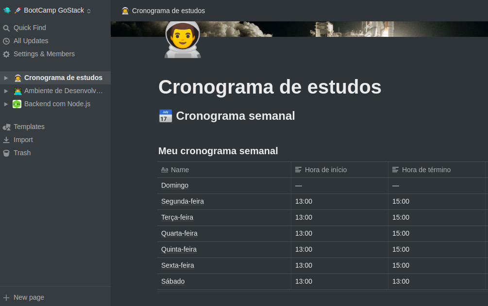
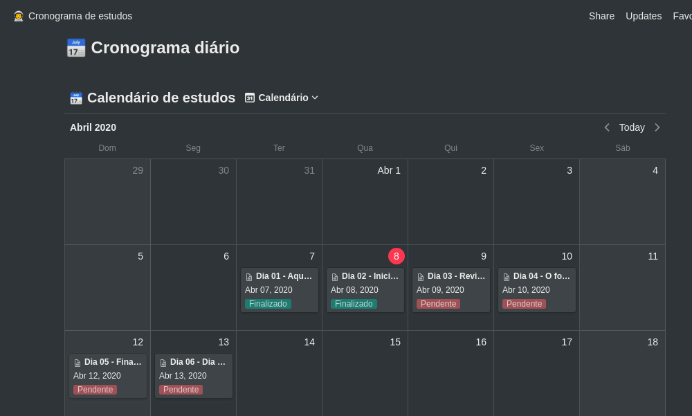

<h2 align="center">
  Desafio 1: Organizando meus estudos
</h2>

Criar um cronograma de estudos e definir os objetivos</blockquote>

  <a href="#rocket-sobre-o-desafio">Sobre o desafio</a>&nbsp;&nbsp;&nbsp;|&nbsp;&nbsp;&nbsp;
  <a href="#calendar-entrega">Entrega</a>&nbsp;&nbsp;&nbsp;|&nbsp;&nbsp;&nbsp;
  <a href="#memo-licença">Licença</a>

## :rocket: Sobre o desafio

Nesse desafio, você deve planejar os seus estudos.

Para isso, você deve criar um cronograma que irá se adaptar ao seu tempo e ritmo.

Defina qual será seu horário de estudo, criando tarefas que estarão atreladas a um calendário, para se manter com foco e sempre alinhado com seus objetivos!

### Modelo de cronograma

Para te ajudar nesse desafio, criamos para você um modelo que você pode duplicar através da plataforma Notion.

O Notion funciona tanto em plataformas mobile, tanto em plataformas desktop, e ambas podem ser baixadas em sua [página oficial](https://www.notion.so/product).

Para começar a utilizar o modelo, você deve acessar o link disponibilizado abaixo, e clicar no botão "Duplicate" que fica no menu do canto superior direito da tela. 

📄 **[Link para o modelo](https://www.notion.so/Cronograma-de-estudos-e390bc8d2f5743668ec03348a3306070)**

### Cronograma semanal

  

### Cronograma diário

  

## :calendar: Entrega

Esse desafio deve ser entregue a partir da plataforma Skylab. Após concluir o desafio, fazer um post no Linkedin sobre ele é uma boa forma de demonstrar seus esforços para evoluir na sua carreira para oportunidades futuras.

## :memo: Licença

Esse projeto está sob a licença MIT. Veja o arquivo [LICENSE](LICENSE.md) para mais detalhes.

---

Feito com 💜 by Diego Cabral :wave: [Linkedin](https://www.linkedin.com/in/diego-pg-cabral/)